# Tasks: Meet-Match (공통 빈시간 계산 및 공유)

**Input**: Design documents from `/specs/001-meet-match/`
**Prerequisites**: ✅ plan.md, spec.md (37+ FRs), research.md (10 decisions), data-model.md (5 tables), contracts/openapi.yaml
**Branch**: `001-meet-match`
**Duration**: 6 weeks (Phase 1A-1F per plan.md)

**Organization**: Tasks grouped by Phase + User Story for independent implementation & testing

## Format Guide

- **[ ]**: Checkbox for progress tracking
- **[ID]**: Sequential task number (T001-T050+)
- **[P]**: Parallelizable task (different files, no dependencies on incomplete tasks)
- **[Story]**: User story label (US1-US5, no label for Setup/Foundational/Polish phases)
- **Description**: Exact file paths provided for clarity

---

## Phase 1: Setup (Project Initialization)

**Purpose**: Project structure and tooling baseline

- [ ] T001 Create project directory structure per plan.md (src/, tests/, docker/, k8s/, docs/)
- [ ] T002 Initialize Python 3.11+ project with Flask/FastAPI, create requirements.txt with core dependencies
- [ ] T003 [P] Setup pytest configuration (pytest.ini) with coverage reporting target (85%+)
- [ ] T004 [P] Setup linting (flake8, pylint) and formatting (black, isort) in src/ and tests/
- [ ] T005 [P] Create .gitignore, README.md with local setup instructions and example API calls
- [ ] T006 Create Docker directory structure: Dockerfile, docker-compose.yml for local PostgreSQL + Flask dev

---

## Phase 2: Foundational (Blocking Prerequisites)

**Purpose**: Core infrastructure that ALL user stories depend on

**⚠️ CRITICAL**: No user story work begins until this phase completes

- [ ] T007 Create SQLAlchemy models in src/models/__init__.py (Group, Submission, Interval, FreeTimeResult, DeletionLog classes with full annotations)
- [ ] T008 [P] Create database migrations framework: alembic init, migration templates in migrations/
- [ ] T009 Create PostgreSQL schema migration script (001_initial.sql) with 5 core tables, constraints, indexes per data-model.md
- [ ] T010 [P] Create repository base class in src/repositories/base.py (CRUD methods, session management)
- [ ] T011 [P] Implement GroupRepository in src/repositories/group.py (create, read, update, list, find_by_token, check_expiry)
- [ ] T012 [P] Implement SubmissionRepository in src/repositories/submission.py (create, read, update, delete, list_by_group)
- [ ] T013 [P] Implement IntervalRepository in src/repositories/interval.py (create, read, list_by_submission, bulk_insert)
- [ ] T014 [P] Implement FreeTimeResultRepository in src/repositories/free_time_result.py (create, read, update, find_latest_by_group)
- [ ] T015 [P] Implement DeletionLogRepository in src/repositories/deletion_log.py (create, list, audit_trail)
- [ ] T016 Create database connection pool and session management in src/lib/database.py
- [ ] T017 [P] Setup FastAPI/Flask app structure in src/main.py with error handlers, middleware (CORS, logging, TLS), request/response interceptors
- [ ] T018 [P] Create structured logging infrastructure in src/lib/logging.py (JSON formatter, PII masking for image URLs/tokens)
- [ ] T019 [P] Create environment configuration management in src/config.py (DATABASE_URL, OCR_LIBRARY, POLLING_INTERVAL_MS, DELETION_BATCH_INTERVAL_SECONDS)
- [ ] T020 Create shared utilities in src/lib/utils.py (pagination, response formatting, error codes enum)

**Checkpoint**: All repositories ready, database connected, logging configured. Ready for user story implementation.

---

## Phase 3: User Story 1 - Group Creation & Initialization (Priority: P1) 🎯 MVP

**Goal**: Enable users to create groups with optional names, select display unit, and receive invite/share URLs

**Independent Test**: Create group → verify invite/share URLs generated, group expires 72h from now, can retrieve group details

### Tests for User Story 1 ✅

- [ ] T021 [P] [US1] Contract test for POST /groups: test_create_group_with_name, test_create_group_without_name in tests/contract/test_groups.py
- [ ] T022 [P] [US1] Contract test for GET /groups/{id}: test_get_group, test_get_expired_group (410 Gone) in tests/contract/test_groups.py
- [ ] T023 [P] [US1] Integration test for group creation E2E in tests/integration/test_group_creation.py: create → read → verify fields
- [ ] T024 [P] [US1] Unit test for nickname generation (random 3-word format) in tests/unit/test_lib_nickname.py

### Implementation for User Story 1

- [ ] T025 [P] [US1] Create nickname generation library in src/lib/nickname.py (3-word adjective_adjective_noun generator, collision detection)
- [ ] T026 [US1] Implement GroupService in src/services/group.py (create_group, get_group, check_expiry_status, calculate_expires_at)
- [ ] T027 [US1] Implement POST /groups endpoint in src/api/groups.py with request validation (group_name optional, display_unit_minutes required: 10/20/30/60)
- [ ] T028 [US1] Implement GET /groups/{groupId} endpoint in src/api/groups.py with lazy expiration check (return 410 if expired)
- [ ] T029 [US1] Add validation for display_unit_minutes in src/lib/validators.py (must be one of 10, 20, 30, 60)
- [ ] T030 [US1] Add request/response logging for group endpoints with PII masking in src/lib/logging.py

**Checkpoint**: Groups can be created with optional names, display units assigned, URLs generated. Expiration timestamp calculated correctly (72h from now). Ready for submission handling (US2).

---

## Phase 4: User Story 2 - Image Submission & OCR Parsing (Priority: P1) 🎯 MVP

**Goal**: Enable participants to upload schedule images, parse via OCR (memory-only), auto-generate nicknames, detect conflicts

**Independent Test**: Upload JPG/PNG → OCR parses → randomnickname assigned → intervals stored → no disk artifacts remain

### Tests for User Story 2 ✅

- [ ] T031 [P] [US2] Contract test for POST /groups/{id}/submissions: test_upload_valid_image, test_upload_invalid_format, test_ocr_timeout in tests/contract/test_submissions.py
- [X] T032 [P] [US2] Unit test for OCR wrapper (Tesseract/PaddleOCR) in tests/unit/test_ocr.py: test_parse_schedule, test_parse_corrupted_image, test_timeout
- [X] T033 [P] [US2] Unit test for slot normalization (conservative ceiling/floor) in tests/unit/test_slot_normalization.py (9:15~9:45 → empty for 30min slots)
- [X] T034 [US2] Integration test for submission flow in tests/integration/test_image_submission.py: upload → parse → store → verify intervals

### Implementation for User Story 2

- [X] T035 [P] [US2] Create OCR wrapper in src/services/ocr.py supporting Tesseract and PaddleOCR with timeout (3s max) and error handling
- [X] T036 [P] [US2] Implement slot normalization in src/lib/slot_utils.py (conservative: ceiling for start, floor for end; 5-min granularity)
- [X] T037 [P] [US2] Create interval extraction logic in src/services/interval_extractor.py (parse OCR text → list of (day, start, end) tuples)
- [X] T038 [US2] Implement SubmissionService in src/services/submission.py (create_submission, store_intervals, detect_duplicate_nickname, update_last_activity)
- [X] T039 [US2] Implement POST /groups/{groupId}/submissions endpoint in src/api/submissions.py with multipart file upload, OCR timeout handling (408 Timeout), image memory-only processing
- [X] T040 [US2] Add response header X-Response-Time to submission endpoint, ensure <5s total (OCR + DB + calc)
- [X] T041 [US2] Verify image is discarded from memory immediately after OCR (add test in tests/unit/test_ocr_memory_cleanup.py)
- [X] T042 [US2] Add submission logging (nickname assigned, interval count, response time) per src/lib/logging.py spec

**Checkpoint**: Images upload successfully, OCR parses within 5s, nicknames auto-assigned uniquely, intervals stored with 5-min normalization. Memory cleaned (no disk artifacts). Ready for calculation (US3).

---

## Phase 5: User Story 3 - Free-Time Calculation & Candidate Generation (Priority: P1) 🎯 MVP

**Goal**: Calculate common free time using AND logic, normalize to display units, generate candidate intervals ranked by duration

**Independent Test**: 3 participants submit schedules → system calculates free-time intersection → candidates ranked by duration (longest first)

### Tests for User Story 3 ✅

- [X] T043 [P] [US3] Unit test for AND calculation in tests/unit/test_and_calculation.py: test_two_person_and, test_three_person_and, test_empty_intersection, test_all_free
- [X] T044 [P] [US3] Unit test for candidate generation in tests/unit/test_candidates.py: test_merge_consecutive_slots, test_min_duration_filter, test_ranking_by_duration
- [X] T045 [P] [US3] Unit test for availability grid generation in tests/unit/test_availability_grid.py: test_grid_structure, test_overlap_count per slot
- [X] T046 [US3] Integration test for calculation E2E in tests/integration/test_calculation.py: 3 submissions → calculate → verify results match expected intersection

### Implementation for User Story 3

- [X] T047 [P] [US3] Implement free-time AND calculator in src/services/calculation.py (intersection of all participant intervals, conservative slot logic)
- [X] T048 [P] [US3] Implement candidate extraction in src/services/candidates.py (merge consecutive free slots, apply min_duration filter, rank by duration/time/overlap)
- [X] T049 [P] [US3] Implement availability grid generator in src/services/availability_grid.py (build full week grid with overlap counts per slot, status_by_day JSONB structure per data-model.md)
- [ ] T050 [US3] Implement CalculationService in src/services/calculation.py (trigger_calculation, recalculate_on_submission, recalculate_on_deletion, version management)
- [ ] T051 [US3] Integrate calculation trigger into SubmissionService (T038): after successful submission, call CalculationService.trigger_calculation
- [ ] T052 [US3] Add calculation versioning: increment version in FreeTimeResult on each recalc, store computed_at timestamp

**Checkpoint**: Free-time calculations accurate for 2-50 participants, candidates ranked correctly, grid shows overlap counts. All results stored with version control. Ready for results visualization (US4).

---

## Phase 6: User Story 4 - Results Visualization & Polling (Priority: P1) 🎯 MVP

**Goal**: Serve calculated free-time results via polling API with server-enforced 2-3s intervals, return heatmap grid + candidate cards

**Independent Test**: Poll GET /groups/{id}/free-time → receive grid + candidates → subsequent requests 2-3s apart (server-enforced), expired group returns 410

### Tests for User Story 4 ✅

- [ ] T053 [P] [US4] Contract test for GET /groups/{id}/free-time in tests/contract/test_free_time.py: test_poll_with_results, test_poll_no_results, test_poll_expired (410)
- [ ] T054 [P] [US4] Contract test for polling interval enforcement in tests/contract/test_polling_interval.py: test_interval_header, test_rapid_requests_throttled
- [ ] T055 [US4] Integration test for polling flow in tests/integration/test_polling.py: submit 3 images → poll multiple times → verify results consistent, intervals enforced

### Implementation for User Story 4

- [ ] T056 [US4] Implement GET /groups/{groupId}/free-time endpoint in src/api/free_time.py with lazy expiration check (410 if expires_at < now), caching of latest result
- [ ] T057 [US4] Add response structure per openapi.yaml: group_id, participant_count, free_time array (day, start, end, duration_minutes, overlap_count), computed_at, expires_at
- [ ] T058 [US4] Implement server-enforced polling interval in src/lib/polling.py: extract client interval_ms from query, ignore it, enforce 2-3s (2000-3000ms) server response header X-Poll-Wait
- [ ] T059 [US4] Add availability grid response: availability_by_day JSONB (array of slots with slot_id, time_window, availability_count, is_common) per spec
- [ ] T060 [US4] Add response headers: X-Response-Time (ms), X-Poll-Wait (2000-3000 ms), X-Calculation-Version
- [ ] T061 [US4] Create frontend template (HTML/JSON response) showing: candidate cards (top 5, ranked), weekly grid heatmap, participants list (nicknames)

**Checkpoint**: Polling API returns correct results, enforces 2-3s intervals, expiration checks work. Grid and candidates visualized. Ready for deletion (US5).

---

## Phase 7: User Story 5 - Expiration & Deletion (Priority: P1) 🎯 MVP

**Goal**: Auto-delete groups 72h after last activity via lazy + batch deletion with exponential retry

**Independent Test**: Create group, check 72h+1min later → lazy check returns 410, batch job validates deletion_logs, retry logic tested with 3 failures

### Tests for User Story 5 ✅

- [ ] T062 [P] [US5] Unit test for lazy deletion in tests/unit/test_lazy_deletion.py: test_check_expiry, test_return_410_when_expired
- [ ] T063 [P] [US5] Unit test for batch deletion simulation in tests/unit/test_batch_deletion.py: test_scan_expired_groups, test_cascade_delete (Group → Submission → Interval → Result)
- [ ] T064 [P] [US5] Unit test for retry logic in tests/unit/test_deletion_retry.py: test_exponential_backoff (1min, 5min, 15min), test_max_retries_alert
- [ ] T065 [US5] Integration test for full deletion flow in tests/integration/test_deletion.py: create group → wait 72h+ → batch job runs → verify all records deleted

### Implementation for User Story 5

- [ ] T066 [P] [US5] Implement lazy deletion check in src/services/deletion.py (check expires_at <= now, trigger soft-delete if needed)
- [ ] T067 [P] [US5] Integrate lazy deletion into GET endpoints (all group/submission/free-time reads check expiry first, return 410 if expired)
- [ ] T068 [P] [US5] Implement batch deletion task in src/services/batch_deletion.py (scan for expires_at <= now, cascade delete Group → Submissions → Intervals → Results → audit log)
- [ ] T069 [P] [US5] Implement exponential retry logic in src/services/batch_deletion.py (failure tracking per group, retry at 1min, 5min, 15min intervals, alert after 3 failures)
- [ ] T070 [US5] Implement DeletionLog recording in src/services/batch_deletion.py (log group_id, deleted_at, reason, submission_count, error_code, retry_count)
- [ ] T071 [US5] Create CronJob specification in k8s/cronjob.yaml (batch deletion runs every 5-15min, restart policy, logging)
- [ ] T072 [US5] Create batch deletion CLI in src/cli/batch_deletion.py for manual testing (python -m src.cli.batch_deletion --dry-run, --force)
- [ ] T073 [US5] Add deletion success rate metric to monitoring (log count of successful vs failed deletions per batch run)

**Checkpoint**: Lazy deletion returns 410 on expired access, batch job removes stale data reliably with retry, audit logs complete. All user stories functional!

---

## Phase 8: Performance Testing & Optimization (Week 3)

**Purpose**: Validate <5s response time, <1s calculation, <500ms polling targets

**Independent Test**: Load test with 50 simultaneous submissions → verify all response times within SLA

### Tests

- [ ] T074 Create load test suite in tests/performance/load_test.py (50 concurrent submissions, measure OCR latency, calculation latency, response times)
- [ ] T075 [P] Profile OCR parsing performance in tests/performance/profile_ocr.py (typical 100KB image, measure CPU, memory, duration)
- [ ] T076 [P] Profile free-time AND calculation in tests/performance/profile_calculation.py (50 participants, measure duration, memory)
- [ ] T077 Create response time tracking dashboard/logging in src/metrics.py (histogram of response times, percentile p95/p99)

### Implementation

- [ ] T078 Optimize database query performance: add covering indexes per data-model.md (expires_at, group_id + nickname, submission_id + day_of_week)
- [ ] T079 [P] Implement result caching for GET /free-time (cache FreeTimeResult for 2s, invalidate on submission/deletion)
- [ ] T080 [P] Implement OCR request queuing if needed (prevent >3 concurrent parses to avoid CPU overload)
- [ ] T081 Profile test and generate performance report: prove <5s upload, <1s calculation, <500ms polling

**Checkpoint**: All response times meet SLA. Performance profile documented.

---

## Phase 9: Security Hardening & Documentation (Week 3)

**Purpose**: TLS, logging masking, API docs, 85%+ test coverage

### Tests

- [ ] T082 [P] Add security audit tests in tests/security/test_tls.py (verify TLS on all endpoints, no plaintext fallback)
- [ ] T083 [P] Add logging audit tests in tests/security/test_logging_masking.py (verify no image URLs, tokens, or PII in logs)
- [ ] T084 Generate test coverage report: pytest --cov=src --cov-report=html, target 85%+
- [ ] T085 [P] Integration test coverage: verify all user story independent tests run green

### Implementation

- [ ] T086 [P] Setup TLS in src/main.py: enforce HTTPS, set HSTS headers, verify certificate path in docker/Dockerfile
- [ ] T087 [P] Implement PII masking in src/lib/logging.py: mask image URLs, access tokens, session cookies in all logs
- [ ] T088 [P] Create API documentation: generate OpenAPI HTML from contracts/openapi.yaml using Swagger UI
- [ ] T089 [P] Create README.md additions: API usage examples (cURL), deployment guide (Docker/K8s), monitoring setup
- [ ] T090 [P] Create ARCHITECTURE.md: design decisions, calculation algorithm explanation, deletion strategy rationale
- [ ] T091 [P] Create CONTRIBUTING.md: dev setup, testing workflow, commit message guidelines
- [ ] T092 Run final test suite: all existing tests pass, coverage 85%+, performance profile green, security audit green
- [ ] T093 Generate API contract validation (test openapi.yaml against implementation) in tests/contract/test_openapi_compliance.py

**Checkpoint**: All documentation complete, 85%+ test coverage achieved, security audit passed, API spec validated. MVP ready for deployment!

---

## Phase 10: Polish & Cross-Cutting Concerns

**Purpose**: Final touches, monitoring setup, operational documentation

- [ ] T094 [P] Create monitoring dashboard template in docs/MONITORING.md (metrics to track: OCR failure rate, calculation latency, polling response time, batch deletion success rate)
- [ ] T095 [P] Add health check endpoint GET /health (returns {"status": "ok", "db": "connected", "timestamp": "..."}) in src/api/health.py
- [ ] T096 [P] Create production deployment checklist in docs/DEPLOYMENT.md (database migrations, env variables, TLS cert setup, CronJob configuration)
- [ ] T097 [P] Create operational playbooks in docs/RUNBOOKS.md (how to manually delete a group, how to retry failed batch job, how to update OCR library)
- [ ] T098 [P] Add graceful shutdown handling in src/main.py (drain in-flight requests, close DB connections on SIGTERM)
- [ ] T099 [P] Create release notes template docs/RELEASE_NOTES_TEMPLATE.md (for future updates)
- [ ] T100 Prepare final PR: all tasks completed, tests green, coverage 85%+, ready for code review

**Checkpoint**: MVP feature complete, ready for production deployment!

---

## Task Dependencies & Critical Path

```mermaid
graph LR
    T001-T006["Phase 1: Setup (T001-T006)"]
    T007-T020["Phase 2: Foundation (T007-T020)"] 
    T021-T030["Phase 3: US1 Groups (T021-T030)"]
    T031-T042["Phase 4: US2 OCR (T031-T042)"]
    T043-T052["Phase 3: US3 Calculation (T043-T052)"]
    T053-T061["Phase 6: US4 Polling (T053-T061)"]
    T062-T073["Phase 7: US5 Deletion (T062-T073)"]
    T074-T081["Phase 8: Performance (T074-T081)"]
    T082-T093["Phase 9: Security & Docs (T082-T093)"]
    T094-T100["Phase 10: Polish (T094-T100)"]
    
    T001-T006 --> T007-T020
    T007-T020 --> T021-T030
    T007-T020 --> T031-T042
    T007-T020 --> T043-T052
    T021-T030 --> T031-T042
    T031-T042 --> T043-T052
    T043-T052 --> T053-T061
    T053-T061 --> T062-T073
    T043-T052 --> T062-T073
    T062-T073 --> T074-T081
    T074-T081 --> T082-T093
    T082-T093 --> T094-T100
```

---

## Parallelization Strategy

### Week 1 Parallelization

**Parallel Track A** (T007-T010): Data model + repositories base
- T007: SQLAlchemy models
- T008, T009: Migrations + schema
- T010: Repository base

**Parallel Track B** (T011-T015): Repository implementations
- T011-T015: All 5 repository classes (no inter-repo dependencies)

**Sequential After Both** (T016-T020): App setup + infrastructure
- Combined with T001-T006 setup tasks

### Week 2 Parallelization

**Parallel Track A** (T025-T030): US1 Group management
- T025: Nickname library
- T026-T030: GroupService + endpoints

**Parallel Track B** (T031-T042): US2 OCR + submission
- T035-T037: OCR + normalization libraries
- T038-T042: SubmissionService + endpoints

**Sequential After Both** (T043-T052): US3 Calculation
- Depends on T026 (GroupService) + T038 (SubmissionService)

### Week 2-3 Parallelization

**Parallel Track A** (T053-T061): US4 Polling API
**Parallel Track B** (T062-T073): US5 Deletion
- Both depend on T043-T052 (calculation) but are independent of each other

### Week 3 Parallelization

**Parallel Track A** (T074-T081): Performance testing
**Parallel Track B** (T082-T093): Security + docs
- Both aggregate results from all prior phases, independent of each other

**Sequential Meeting Point** (T094-T100): Polish
- Final integration and production readiness

---

## Success Metrics (Measurable Outcomes)

| Metric | Target | Measured By |
|--------|--------|-------------|
| **Response Time (upload→result)** | <5s | Load test (T074), prod monitoring |
| **Free-time Calculation** | <1s | Profiling test (T076) |
| **Polling Response** | <500ms | Load test (T074) |  
| **Test Coverage** | 85%+ | pytest --cov report (T084) |
| **OCR Failure Rate** | <5% | Production metrics (T073, T094) |
| **Deletion Reliability** | 100% no retry exhaustion | Batch deletion verification (T072) |
| **Slot Accuracy** | 100% normalization correct | Unit tests (T033, T043) |
| **TLS Enabled** | 100% on prod | Security audit (T082) |
| **PII Masking** | 100% in logs | Logging audit (T083) |

---

## Previous Design Decisions (Reference)

- **OCR Library**: Tesseract 0.3.10 (via pytesseract) or PaddleOCR (both in-memory)
- **Slot Unit**: 5-minute internal normalize (conservative ceiling/floor), display in 10/20/30/60-min units
- **Calculation**: AND logic at submission time (new ∩ existing), full recalc on deletion
- **Deletion**: Lazy (request-time check) + batch (5-15min) with exponential retry (1min, 5min, 15min)
- **Polling**: Server-enforced 2-3s intervals (ignore client requests)
- **Retention**: 72h from last_activity_at (last submission), auto-delete cascade

---

## Success Criteria (From Spec)

✅ SC-001: Group creation → invite link in <1 minute  
✅ SC-002: Image upload → grid generation in <10 seconds (single 100KB image)  
✅ SC-003: All submissions complete → final result in <5 seconds  
✅ SC-004: Result page rendering in <2 seconds  
✅ SC-005: Calculation accuracy 100% (unit test coverage)  
✅ SC-006: Auto-deletion verified 72h post-creation (deletion logs)  
✅ SC-007: Mobile grid scrolling smooth (60fps)  
✅ SC-008: Multi-user polling with no response degradation (stateless design)  

---

**Next Step**: Begin Phase 1 (Setup) tasks. Recommended: T001-T006 completed by EOD, T007-T020 by end of Week 1.

**Estimated Current State**: Ready for immediate implementation. All design decisions finalized. All blockers removed. MVP scope clear. Go! 🚀
